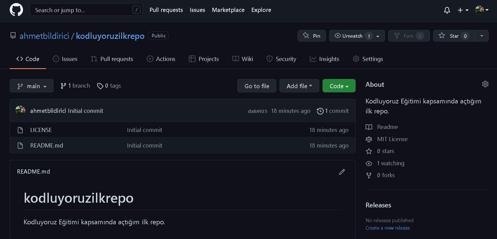

# Kodluyoruz İlk Repo

Bu repo [Kodluyoruz](https://www.kodluyoruz.org/) Front-End eğitiminde oluşturduğumuz ilk repo. İçerisinde bir adet README dosyası, bir adet de index.html barındırıyor.
<br><br>
## Installation
Öncelikle projeyi clonelayın.
```git
git clone https://github.com/ahmetbildirici/kodluyoruzilkrepo.git
```
<br>

## Usage
Projeyi cloneladıktan sonra Visual Studio Code programında açınız.<br><br>
Linux İçin:
```git
cd kodluyoruzilkrepo
code .
```
<br>

## Contributing
Pull requestler kabul edilir. Büyük değişiklikler için, lütfen önce neyi değiştirmek istediğinizi tartışmak için bir konu açınız.<br><br>

## License
[MIT](https://opensource.org/licenses/MIT)